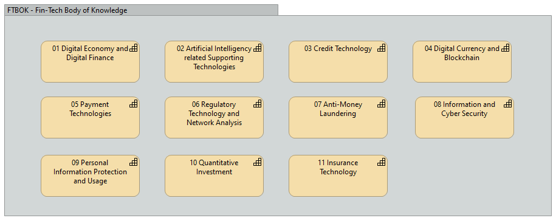

# Overview of FTBOK

This article is referring the book 《金融科技知识图谱》, utilizing its great classification on the knowledge base for Fin-Tech field. The book is written by China's Fin-Tech Theory and Application Research Group, the contents are closely relating to the situation from China's practice. My view here is to expand from the theory and adding more information from cross-markets, and cross-culture aspect.

Below, in the book, there're 11 main groups defined to form the overall Fin-Tech, the article will break down the group with further detail level key technologies one by one.

The language in the article will be mixing between Chinese and English, depending on which one is more accurately explaining the concept. There will be Glossary table in the last chapters for reference.

